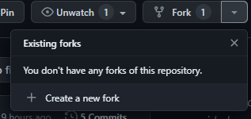
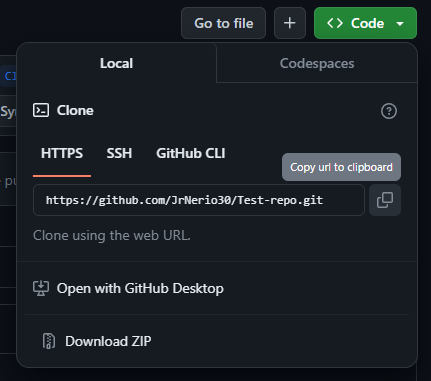
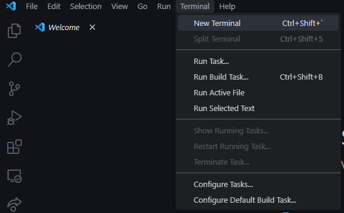
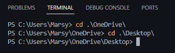
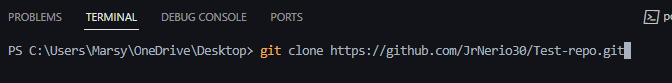
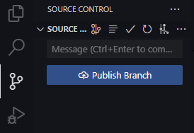
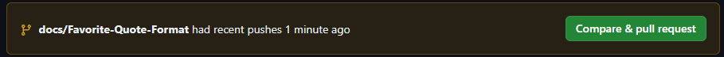
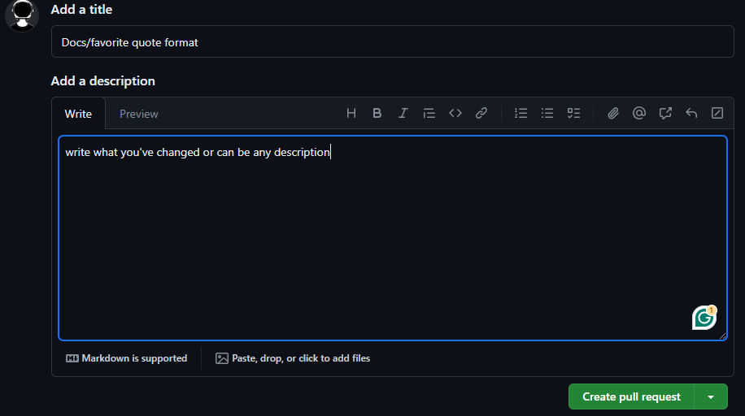

<h1 align="center">Favorite Quotes</h1>
<p align="center">Share a cherished quote with its author, whether it's a renowned figure, someone close to you, or a gem from your own reflections. Quotes often encapsulate wisdom, humor, or profound moments, serving as timeless reminders that resonate across time and experiences.</p>

<p align="center">
  
</p>

<h1 align="center">Instructions</h1>

<!-- Step 1 -->

### `1. Create a new fork`



<!-- Step 2 -->

### `2. Copy the forked repository`


<!-- Step 3 -->

### `3. Open Visual Studio Code (New Window) and open a new terminal`


<!-- Step 4 -->

### `4. Navigate to your home folder or USER/(NAME OF THE USER)/ONEDRIVE/DESKTOP`
```
1. cd onedrive
2. cd desktop
OR for Mac, just cd desktop if you don't have onedrive
```



<!-- Step 5 -->

### `5. Paste the forked repository link in the terminal`
```
git clone <repository url>
```


> The terminal should say that it's finished or done.

<!-- Step 6 -->

### `6. Create a new branch before adding changes`
```
git branch <new branch name>
```
<!-- Step 7 -->

### `7. Add your favorite quote and the person who created the quote` [Here](#Here)
```
<h1 align="center"><First Name></h1>
<h3 align="center"> Your Quote </h3>
<p align="center">(-) <who?> </p> 
```

<!-- Step 8 -->

### `8. Ones you're finished adding your quote, save it then follow the command below`
> For Windows: Ctrl + S

> For Mac: ⌘ + S
```
Open the terminal and type in:
git add .
or 
git add <readme file>
then 
git commit -m "docs: <the changes you've made>"
```

<!-- Step 9 -->

### `9. Then push that b**** in!`
```
git push origin <your branch>
```
> This will push your branch and your commits.

>If you still see this. Just click publish branch


### `10. Create a pull request and write a description`




> [!CAUTION] 
> Do not merge it! Please🥺

### `11. Wait for the host to merge it`


<h1 align="center">Add your Favorite Quote here</h1>
<h4 align="center">Here</h4>
<p align="center">Arrange the letters of your first name in alphabetical order from A-Z, and use it as the title.</p>
<!-- Typing gif -->
<p align="center">

</p>

<!-- Type in your favorite quote here -->
<h1 align="center">Fernando</h1>
<h3 align="center">"Code is poetry written in the language of logic."</h3>
<p align="center">- ChatGPT </p>

